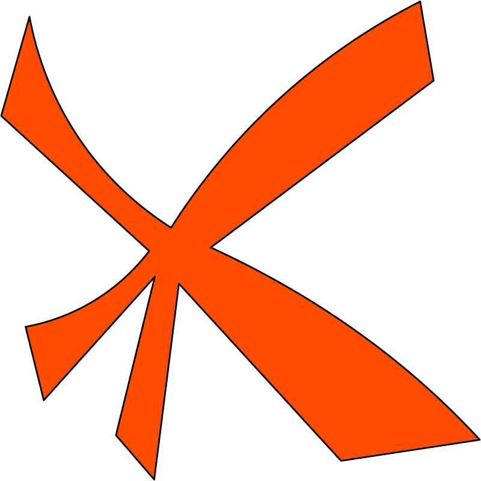

<div align="center">



```
█   █  ███  ████  █████ █████  ████ █   █
█  █  █   █ █   █   █   █     █      █ █
███   █   █ ████    █   ████  █       █
█  █  █   █ █  █    █   █     █      █ █
█   █  ███  █   █   █   █████  ████ █   █
```

**The open runtime for building and running AI agents at scale.**
Turn what you know into dependable, autonomous work — described in plain language, owned by you.

🌐 **[kortecx.com](https://kortecx.com)** &nbsp;·&nbsp; built in the open at [Kortecx/kortecx](https://github.com/Kortecx/kortecx)

[](https://github.com/Kortecx/kortecx/actions/workflows/ci.yml)
[](LICENSE.md)
[](rust-toolchain.toml)
[](#)
[](#)

</div>

---

## Why Kortecx

AI agents are the highest-leverage way to put intelligence to work — yet building and running them
at scale is still hard, brittle, and locked behind bespoke infrastructure. **Kortecx exists to
change that: to make AI adoption at scale practical, and to lower the barrier to *create* and *use*
AI agents** — so any team can turn what it knows into dependable, autonomous work without standing
up a platform first.

We build around four convictions:

- **Agents must be durable.** Real work can't vanish on a crash or fire a side effect twice. Every
  step runs on an append-only journal — a crash replays from committed work, and a step that already
  touched the world is re-read, never re-run.
- **Creating an agent should be as easy as describing it.** Say what you want in plain language; the
  runtime plans, writes, and wires the whole project — tools, skills, data, and files.
- **Capability must never outrun authority.** A model can *propose* anything; only the runtime's
  checks let an action *happen*. Every tool call is gated by a server-issued warrant the model can
  never mint for itself.
- **It should run anywhere, owned by you.** One small binary, your models, your data — local-first,
  no daemon required, no vendor lock-in.

## What you can build

- **Apps you describe in a sentence** — scheduled automations, or real web apps the runtime
  scaffolds and serves for you.
- **Live agent loops** — reason → call a tool → observe → answer, where every turn is a durable fact.
- **Workflows and chains** — reusable DAGs of agentic steps, expressible as a one-line string, a
  fluent builder, or a portable JSON file.
- **Answers grounded in your own data** — content-addressed corpora the model searches itself.
- **Agents that remember** — facts recalled by meaning across runs.

## Try it

```bash
curl -fsSL https://raw.githubusercontent.com/Kortecx/kortecx/main/scripts/install.sh | sh
kx serve --dev-allow-local
# → gRPC 127.0.0.1:50151 · events ws://127.0.0.1:50152 · web console http://127.0.0.1:8888
```

Open the console and you have the whole runtime in a browser. Zero config: the journal, content
store, and catalog auto-resolve under `~/.kortecx` and are reused across restarts.

The prebuilt binary talks to a running [Ollama](https://ollama.com) daemon for local models with no
C++ toolchain. To serve a model fully in-process instead, build from source with the `inference`
feature — see [Local inference & models](#local-inference--models).

## Authoring apps in natural language

An **App** is the durable, shareable unit of agentic capability. You describe it; the runtime plans
it, writes its project files, and runs it. There are two kinds.

### Scheduled apps

Headless apps that run on demand, on a cron or interval trigger, or inside a workflow. Two ways to
use them:

- **Contextual** — the app carries its own project of markdown files (prompts, rules, skills,
  reference notes). At run time the runtime hands that context to the model, and the model acts
  through the tools, skills, and data you granted it.
- **Codified** — a programmatic workflow that runs exactly as instructed, every time. A scheduled
  automation with no room for improvisation.

Both are the same kind under the hood; the difference is how much you leave to the model.

### Hosted apps

Real web apps the runtime scaffolds from your description and serves on a local port. The model
plans a source tree, writes each file, and the runtime installs dependencies, type-checks the
project, and starts a dev server. Three frameworks today — **Vite + React**, **Next.js**, and
**Svelte** — with more to come.

> **Honestly, today:** a hosted app runs as a plain subprocess on a loopback port. There is no
> sandbox and no container isolation yet — running them in isolated environments (Docker) is on the
> roadmap, not shipped. Serving one needs Node and npm on the host. Because the project is written
> by a model, the runtime type-checks it before serving: a project that doesn't compile fails
> loudly with the compiler's own message rather than serving a blank page.

## Live agent loops

A bounded loop — reason, call a tool, observe, answer — where every turn is committed to the journal
before the next begins. Crash halfway and it resumes from the last committed turn.

```bash
kx chat --tools 'fs-list@1,fs-read@1' \
  --message 'Find the quarterly notes and tell me what the two incidents were.'
```

The model decides which tools to call and when to stop. Each call is staged, authorized against a
server-issued warrant, then committed — so you can always ask what an agent actually did, and
replay it.

## Workflows, chains & forms

Compose steps with a tiny string DSL — `>` sequences, `&` runs in parallel, `|` alternates, and
`[ ]` groups:

```bash
kx chain run "research > [critique & summarize] > publish" \
  --task research='{"kind":"model","prompt":"Research append-only journals."}' \
  --task critique='{"kind":"model","prompt":"Critique the findings."}' \
  --task summarize='{"kind":"model","prompt":"Summarize in three bullets."}' \
  --task publish='{"kind":"model","prompt":"Write the final note."}' \
  --wait
```

Workflows take typed inputs, so the console renders a form for any of them automatically.

## The chainable SDK

The whole runtime is a chainable SDK. The same expression lowers identically from the CLI, Python,
and TypeScript — pinned by a shared golden corpus — so you can author in whichever fits and get the
same DAG.

**Python**

```python
import kortecx as kx

out = (kx.flow()
       .agent("Research append-only journals.", tools=["mcp-echo/echo"])
       .then("Critique the findings.")
       .then("Summarize in three bullets.")
       .run())
print(out.text)
```

**TypeScript**

```ts
import { flow } from "@kortecx/sdk";

const out = await flow()
  .agent("Research append-only journals.", { tools: ["mcp-echo/echo"] })
  .then("Critique the findings.")
  .then("Summarize in three bullets.")
  .run();
console.log(out.text);
```

Both resolve the endpoint and token from `KX_ENDPOINT` / `KX_TOKEN` (defaulting to
`http://127.0.0.1:50151`), so a local `--dev-allow-local` serve needs no arguments.

**Export a chain and re-run it.** Any chain lowers to a portable JSON file — steps, edges, and seed
— that you can commit, share, and replay:

```python
c = kx.chain("research > critique", tasks)
c.export("research.json")                       # portable JSON

req = kx.Chain.from_blueprint_file("research.json")
client.submit_workflow(req, wait=True)          # re-run it anywhere
```

```bash
kx chain run "research > critique" --tasks tasks.json --emit-blueprint research.json --dry-run
kx blueprint run --file research.json --wait
```

`--dry-run` lowers and validates entirely offline — no gateway, no model.

Beyond `.agent()` / `.then()`, a flow composes multi-agent shapes — `.swarm()`, `.team()`,
`.supervisor()`, `.consensus()`, `.map_reduce()`, `.review_loop()` — and attaches capability:
`.context(handle)` for retrieval, `.with_memory([...])`, `.with_mcp(...)` for an external tool
server, and `.as_app(name)` to save the whole thing as an App. Note the TypeScript orchestration
helpers take an array (`swarm([a, b], { goal })`) where Python takes varargs.

## Local inference & models

Two engines, your choice:

- **Ollama** — zero toolchain. Point Kortecx at a running daemon and serve any model it has.
- **In-process llama.cpp** — fully self-contained, text and vision, no daemon. Build with
  `--features inference,hnsw`.

A model is checked for fitness before it is served, and `kx models` lists what is actually
available. A run names the model it wants and is refused if that model isn't served — it never
silently degrades to a different one.

## Datasets & grounded RAG

Ingest a corpus into a durable, content-addressed store; the model searches it **itself** with a
built-in `retrieve` tool that fuses keyword and vector search, and every answer cites the exact
passages it read.

```bash
kx datasets ingest handbook --file ./handbook.md
kx invoke kx/recipes/react-rag --wait \
  --args '{"instruction":"What does our expense policy require for a 600 euro purchase?","dataset":"handbook","max_turns":6,"max_tool_calls":6}'
```

The model writes its own search query, reads what comes back, and can search again before
answering. Grounding is steering, not a hard constraint — a capable model reliably searches, but
nothing forces it to. The store is append-only and deduplicates by content.

## Durable memory

Agents remember facts and recall them by **meaning** across runs, with reversible time-and-salience
decay (nothing is hard-deleted) and a one-command `consolidate` that distils episodic notes into
lasting knowledge.

```bash
kx memory add "Our staging cluster runs in the Frankfurt region."
kx memory recall --text "Which European datacenter hosts our pre-production environment?"
# → the Frankfurt fact, with no words in common
```

Needs `--features inference,hnsw`, a served model, and `KX_SERVE_MEMORY=1`.

> **Choose an embedding model before you store anything.** By default the primary chat model is
> reused as the embedder, and a generative decoder makes a weak sentence embedder — paraphrased
> queries rank poorly. Point `KX_SERVE_EMBED_MODEL` at a real embedding model and recall becomes
> decisively better. A memory store fixes its vector dimension on first write, so switching
> embedders later means starting a new store.

## The web console

Served straight from the binary — no separate deploy, no build step. It streams every agent's
events live and lets you scrub a run's whole history with a time-travel slider: pin any moment,
inspect what the agent saw, then jump back to live. The live tail polls a few times a second rather
than pushing, and the run "latency" it shows is a commit-sequence span, not milliseconds.

## Observability & cost

`kx cost <run>` gives a deterministic local spend estimate, priced per model turn and tool call at
your own rates. It is a budget guardrail for your own planning, not a billing meter — the estimate
is display-only, and cost ceilings are off by default.

## Security defaults

- Deny-all by default: a tool call happens only under a warrant the server issued.
- Loopback binds by default; an auth posture is **required** to start a server.
- CORS is deny-by-default; browser origins must be named explicitly.
- Tokens are never persisted — the console keeps a bearer token in memory only.
- Capability checks are exact-equality. Scores, rankings, and recommendations are advisory and can
  never authorize an action.

## Install & prerequisites

The prebuilt binary is the fastest path and needs nothing but a shell:

```bash
curl -fsSL https://raw.githubusercontent.com/Kortecx/kortecx/main/scripts/install.sh | sh
```

It ships the web console and the dataset data-plane, and serves local models through Ollama.

From source, one line gets you the same thing:

```bash
cargo install --path crates/kx-cli --features console,hnsw,serve-engine,hosted-apps
```

Swap `serve-engine` for `inference` to build the in-process llama.cpp engine — that needs CMake, a
C++ toolchain, and the `crates/kx-llamacpp-sys/llama.cpp` submodule. Building the console from
source needs Node ≥ 22. Hosted apps need Node and npm at run time.

The gating story in one line: `--features inference,hnsw` plus a served model unlocks
server-embedded retrieval and memory; memory also needs `KX_SERVE_MEMORY=1`.

Run `kx --help` for the full command surface.

## Production notes

- **TLS** — serve behind TLS with `--tls-cert` / `--tls-key`, or terminate upstream.
- **Scale** — single-system by default; the same workflows run unchanged when distributed
  deployment lands.
- **Inference** — the prebuilt is FFI-free; build with `inference` only where you want the
  in-process engine.
- **Versions** — early development. Interfaces may change before 1.0; pin a commit if you build
  on it.

## Contributing

Contributions are welcome — see [CONTRIBUTING.md](CONTRIBUTING.md), and [GLOSSARY.md](GLOSSARY.md)
for the vocabulary the codebase uses.

## License

Kortecx is **fair-code** distributed under the [Sustainable Use License](LICENSE.md): free to use,
study, modify, and self-host for your own work, including inside your company. What it does not
allow is repackaging Kortecx and selling it to others as a competing hosted service.

Want to use it in a way the license doesn't cover? Reach out at **hello@kortecx.com**.

Third-party components keep their own licenses — see
[THIRD-PARTY-NOTICES.md](THIRD-PARTY-NOTICES.md).

## Links

- Website — [kortecx.com](https://kortecx.com)
- Documentation — [`docs/site`](docs/site)
- Changelog — [CHANGELOG.md](CHANGELOG.md)
- Security policy — [SECURITY.md](SECURITY.md)
