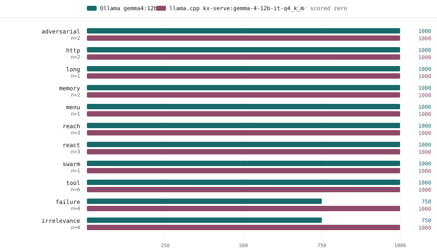

<div align="center">


```
█   █ █████ █████ █████ █████ █████ █   █
█  █  █   █ █   █   █   █     █      █ █ 
███   █   █ █████   █   ████  █       █  
█  █  █   █ █  █    █   █     █      █ █ 
█   █ █████ █   █   █   █████ █████ █   █
```

**The open runtime for building and running AI agents at scale.**
Turn what you know into dependable, autonomous work — described in plain language, owned by you.

🌐 **[kortecx.com](https://kortecx.com)** &nbsp;·&nbsp; built in the open at [Kortecx/kortecx](https://github.com/Kortecx/kortecx)

[](https://github.com/Kortecx/kortecx/actions/workflows/ci.yml)
[](LICENSE.md)
[](rust-toolchain.toml)
[](#)
[](#)

</div>

---

## Why Kortecx

AI agents are the highest-leverage way to put intelligence to work — yet building and running them
at scale is still hard, brittle, and locked behind bespoke infrastructure. **Kortecx exists to
change that: to make AI adoption at scale practical, and to lower the barrier to *create* and *use*
AI agents** — so any team can turn what it knows into dependable, autonomous work without standing
up a platform first.

We build around four convictions:

- **Agents must be durable.** Real work can't vanish on a crash or fire a side effect twice. Every
  step runs on an append-only journal — a crash replays from committed work, and a step that already
  touched the world is re-read, never re-run.
- **Creating an agent should be as easy as describing it.** Say what you want in plain language; the
  runtime plans, writes, and wires the whole project — tools, skills, data, and files.
- **Capability must never outrun authority.** A model can *propose* anything; only the runtime's
  checks let an action *happen*. Every tool call is gated by a server-issued warrant the model can
  never mint for itself.
- **It should run anywhere, owned by you.** One small binary, your models, your data — local-first,
  no daemon required, no vendor lock-in.

## What you can build

- **Apps you describe in a sentence** — scheduled automations, or real web apps the runtime
  scaffolds and serves for you.
- **Live agent loops** — reason → call a tool → observe → answer, where every turn is a durable fact.
- **Workflows and chains** — reusable DAGs of agentic steps, expressible as a one-line string, a
  fluent builder, or a portable JSON file.
- **Answers grounded in your own data** — content-addressed corpora the model searches itself.
- **Agents that remember** — facts recalled by meaning across runs.

## Try it

```bash
curl -fsSL https://raw.githubusercontent.com/Kortecx/kortecx/main/scripts/install.sh | sh
kx serve --dev-allow-local
# → gRPC 127.0.0.1:50151 · events ws://127.0.0.1:50152 · web console http://127.0.0.1:8888
```

Open the console and you have the whole runtime in a browser. Zero config: the journal, content
store, and catalog auto-resolve under `~/.kortecx` and are reused across restarts.

The prebuilt binary talks to a running [Ollama](https://ollama.com) daemon for local models with no
C++ toolchain. To serve a model fully in-process instead, build from source with the `inference`
feature — see [Local inference & models](#local-inference--models).

## Authoring apps in natural language

An **App** is the durable, shareable unit of agentic capability. You describe it; the runtime plans
it, writes its project files, and runs it. There are two kinds.

### Scheduled apps

Headless apps that run on demand, on a cron or interval trigger, or inside a workflow. Two ways to
use them:

- **Contextual** — the app carries its own project of markdown files (prompts, rules, skills,
  reference notes). At run time the runtime hands that context to the model, and the model acts
  through the tools, skills, and data you granted it.
- **Codified** — a programmatic workflow that runs exactly as instructed, every time. A scheduled
  automation with no room for improvisation.

Both are the same kind under the hood; the difference is how much you leave to the model.

### Hosted apps

Real web apps the runtime scaffolds from your description and serves on a local port. The model
plans a source tree, writes each file, and the runtime installs dependencies, type-checks the
project, and starts a dev server. Three frameworks today — **Vite + React**, **Next.js**, and
**Svelte** — with more to come.

> **Honestly, today:** a hosted app runs as a plain subprocess on a loopback port. There is no
> sandbox and no container isolation yet — running them in isolated environments (Docker) is on the
> roadmap, not shipped. Serving one needs Node and npm on the host. Because the project is written
> by a model, the runtime type-checks it before serving: a project that doesn't compile fails
> loudly with the compiler's own message rather than serving a blank page.

## Live agent loops

A bounded loop — reason, call a tool, observe, answer — where every turn is committed to the journal
before the next begins. Crash halfway and it resumes from the last committed turn.

The read-only host file tools are default-OFF. Grant them a root when you start the
serve — in its own terminal, since it runs in the foreground:

```bash
KX_SERVE_FS_ROOT=~/notes kx serve --dev-allow-local
```

```bash
kx chat --tools 'fs-list@1,fs-read@1' \
  --message 'Find the quarterly notes and tell me what the two incidents were.'
```

Both legs are required: without a granted root, or without a served model, those
tools never register and the runtime refuses the command by name rather than
guessing — `agentic step references unregistered tool fs-list@1`.

The model decides which tools to call and when to stop. Each call is staged, authorized against a
server-issued warrant, then committed — so you can always ask what an agent actually did, and
replay it.

## Workflows, chains & forms

Compose steps with a tiny string DSL — `>` sequences, `&` runs in parallel, `|` alternates, and
`[ ]` groups:

```bash
kx chain run "research > [critique & summarize] > publish" \
  --task research='{"kind":"model","prompt":"Research append-only journals."}' \
  --task critique='{"kind":"model","prompt":"Critique the findings."}' \
  --task summarize='{"kind":"model","prompt":"Summarize in three bullets."}' \
  --task publish='{"kind":"model","prompt":"Write the final note."}' \
  --wait
```

Workflows take typed inputs, so the console renders a form for any of them automatically.

## The chainable SDK

The whole runtime is a chainable SDK. The same expression lowers identically from the CLI, Python,
and TypeScript — pinned by a shared golden corpus — so you can author in whichever fits and get the
same DAG.

**Python**

```python
import kortecx as kx

out = (kx.flow()
       .agent("Research append-only journals.", tools=["mcp-echo/echo"])
       .then("Critique the findings.")
       .then("Summarize in three bullets.")
       .run())
print(out.text)
```

**TypeScript**

```ts
import { flow } from "@kortecx/sdk";

const out = await flow()
  .agent("Research append-only journals.", { tools: ["mcp-echo/echo"] })
  .then("Critique the findings.")
  .then("Summarize in three bullets.")
  .run();
console.log(out.text);
```

Both resolve the endpoint and token from `KX_ENDPOINT` / `KX_TOKEN` (defaulting to
`http://127.0.0.1:50151`), so a local `--dev-allow-local` serve needs no arguments.

**Export a chain and re-run it.** Any chain lowers to a portable JSON file — steps, edges, and seed
— that you can commit, share, and replay:

```python
c = kx.chain("research > critique", tasks)
c.export("research.json")                       # portable JSON

req = kx.Chain.from_blueprint_file("research.json")
client.submit_workflow(req, wait=True)          # re-run it anywhere
```

```bash
kx chain run "research > critique" --tasks tasks.json --emit-blueprint research.json --dry-run
kx blueprint run --file research.json --wait
```

`--dry-run` lowers and validates entirely offline — no gateway, no model.

Beyond `.agent()` / `.then()`, a flow composes multi-agent shapes — `.swarm()`, `.team()`,
`.supervisor()`, `.consensus()`, `.map_reduce()`, `.review_loop()` — and attaches capability:
`.context(handle)` for retrieval, `.with_memory([...])`, `.with_mcp(...)` for an external tool
server, and `.as_app(name)` to save the whole thing as an App. Note the TypeScript orchestration
helpers take an array (`swarm([a, b], { goal })`) where Python takes varargs.

## Local inference & models

Two engines, your choice:

- **Ollama** — zero toolchain. Point Kortecx at a running daemon and serve any model it has.
- **In-process llama.cpp** — fully self-contained, text and vision, no daemon. Build with
  `--features inference,hnsw`.

A model is checked for fitness before it is served, and `kx models` lists what is actually
available. A run names the model it wants and is refused if that model isn't served — it never
silently degrades to a different one.

## Datasets & grounded RAG

Ingest a corpus into a durable, content-addressed store; the model searches it **itself** with a
built-in `retrieve` tool that fuses keyword and vector search, and every answer cites the exact
passages it read.

```bash
kx datasets ingest handbook --file ./handbook.md
kx invoke kx/recipes/react-rag --wait \
  --args '{"instruction":"What does our expense policy require for a 600 euro purchase?","dataset":"handbook","max_turns":6,"max_tool_calls":6}'
```

The model writes its own search query, reads what comes back, and can search again before
answering. Grounding is steering, not a hard constraint — a capable model reliably searches, but
nothing forces it to. The store is append-only and deduplicates by content.

## Durable memory

Agents remember facts and recall them by **meaning** across runs, with reversible time-and-salience
decay (nothing is hard-deleted) and a one-command `consolidate` that distils episodic notes into
lasting knowledge.

```bash
kx memory add "Our staging cluster runs in the Frankfurt region."
kx memory recall --text "Which European datacenter hosts our pre-production environment?"
# → the Frankfurt fact, with no words in common
```

Needs `--features inference,hnsw`, a served model, and `KX_SERVE_MEMORY=1`.

> **Choose an embedding model before you store anything.** By default the primary chat model is
> reused as the embedder, and a generative decoder makes a weak sentence embedder — paraphrased
> queries rank poorly. Point `KX_SERVE_EMBED_MODEL` at a real embedding model and recall becomes
> decisively better. A memory store fixes its vector dimension on first write, so switching
> embedders later means starting a new store.

## The web console

Served straight from the binary — no separate deploy, no build step. It streams every agent's
events live and lets you scrub a run's whole history with a time-travel slider: pin any moment,
inspect what the agent saw, then jump back to live. The live tail polls a few times a second rather
than pushing, and the run "latency" it shows is a commit-sequence span, not milliseconds.

## Measured, not asserted

Agent quality here is a number you can gate on. Two suites, one set of scorers:

- **The golden gate** (`kx eval run`) replays scripted transcripts — deterministic, model-free,
  runs in CI, and fails closed on any regression.
- **The oracle benchmark** (`just eval-bench`) drives real tasks on a **served model** and grades
  each run's own committed answer with those same scorers. It ratchets against a committed
  per-engine baseline, so a capability regression fails rather than quietly scoring lower.
  The suite-wide score always gates. A single family gates only where it has at least three
  tasks — six of the eleven published families do not, and on those a move is reported but
  not failed, because a one-task family reads 0 or 1000 and nothing in between. The task
  count is printed beside every family for exactly this reason.

**Reading a score.** Every score is an integer **per-mille** — a rate on a 0–1000 scale
(769 ≡ 76.9%), never a count — and an aggregate is the **floor** of the integer mean over the
tasks it applied to: a suite-wide `804 · 37/46` is floor(1000·37/46), not "717 of 1000
calls". Resolution follows the denominator: a one-task family can only read 0 or 1000, a
three-task family only 0 · 333 · 666 · 1000, and the 46-task suite moves in steps of ~22.
Where a metric is pass/fail per unit — `task_success` everywhere, `injection_resistance`,
the exact-order `tool_seq_fsa`, `pass_k4` per flagship task, and `retrieval_success_at_8`
per query — the exact fraction is printed beside the rate, so `666 · 2/3` means two of
three units passed. A † metric is graded per task and then averaged, so no task fraction
exists for it; a ‡ metric is graded too, but exactly one task in the corpus exercises it,
so its suite-wide number is that single task's score.

The **oracle is substring containment** on the run's own committed answer — not an LLM
judge — and the facts it asks for exist only in the fixtures, so a correct answer is
evidence the tool actually ran. (Published prior art for the shape: RAGAS
`StringPresence`. It is deliberately **not** called "faithfulness" — that word means
judge-scored claim coverage, which this is not.) Full definitions:
[Evaluation](docs/site/docs/evaluation.md).

**Environment.** Everything below was captured on `macos/aarch64`, 8 cores, over **46 tasks**,
on two Gemma-4-family builds — Ollama `gemma4:12b` and a llama.cpp GGUF served as
`kx-serve:gemma-4-12b-it-q4_k_m`. They are not the same build, and the columns are not
interchangeable. The label travels in the committed baseline, and CI holds this text to it.

A baseline is a measurement of ONE commit, and fixes land between captures — so a table can
publish a zero for something already repaired. **Treat every number here as "as of the
capture named beside the chart" and re-run `just eval-bench` for the current tree.** Numbers
are only refreshed by a deliberate two-engine re-capture, never edited by hand, which is why
a fix can be live before the table moves.

The capture's commit and date are rendered from the baselines themselves rather than typed
here — a previous hand-written provenance line named a capture two weeks and fourteen commits
old while every number beside it was current, and the gate that checks those numbers could
not see the sentence.

### Per-capability — `task_success@<family>`

A family's score is the floor mean over its bucket — the fraction beside each rate is the
exact pass count.

| Family | Tasks | What a task proves | Ollama | llama.cpp |
| --- | ---: | --- | ---: | ---: |
| **tool** | 6 | picks the right tool, and carries its result into the NEXT tool call | 1000 · 6/6 | 1000 · 6/6 |
| **react** | 3 | decides *whether* to use a tool: refuses an ungranted one, reaches for a needed one, answers a known fact without either | 1000 · 3/3 | 1000 · 3/3 |
| **reach** | 3 | reaches past the prompt — searches a dataset of 61 documents built around near-misses, recalls a memory, inherits a capability | 1000 · 3/3 | 1000 · 3/3 |
| **swarm** | 1 | N agents in parallel, one gather merging their committed outputs | 1000 · 1/1 | 1000 · 1/1 |
| **http** | 2 | reaches a tool over the **network** under a bearer credential, and pages through a result set | 1000 · 2/2 | 1000 · 2/2 |
| **failure** | 4 | recovers when a tool errors, hangs, or returns garbage — and a healthy control that fails if it starts distrusting every tool | 750 · 3/4 | 1000 · 4/4 |
| **menu** | 1 | picks correctly from a menu as long as the runtime will present | 1000 · 1/1 | 1000 · 1/1 |
| **long** | 1 | sustains six tool calls across four tools inside the eight-turn ceiling | 1000 · 1/1 | 1000 · 1/1 |
| **adversarial** | 2 | ignores an instruction planted in a tool's OUTPUT — while still acting on a legitimate request that merely looks like one | 1000 · 2/2 | 1000 · 2/2 |
| **irrelevance** | 4 | declines to fire when NOTHING on the menu applies — an email send and a live weather read no granted tool can serve — beside two look-alikes phrased the same way that a granted tool must serve, so an always-refuse policy fails | 750 · 3/4 | 1000 · 4/4 |
| **memory** | 2 | updates a stored fact and answers with the NEW value while the superseded row is still live, and abstains when memory holds no answer | 1000 · 2/2 | 1000 · 2/2 |

The headline comparison — both engines, one graph, same model family. Bars are
`task_success` per-mille; `n` is the number of tasks behind each bar, because a 1000
from one task is one pass and a 1000 from six is six.

<!-- bench-chart:comparison — GENERATED by docs/site/scripts/render-bench-chart.mjs
     from crates/kx-eval/corpus/bench-v1/baseline.*.json and validated by
     docs/site/scripts/check-docs.mjs. Series order: Ollama, llama.cpp.
     Keep this anchor. -->
<picture>
  <source media="(prefers-color-scheme: dark)" srcset="docs/assets/bench-agentic-dark.svg">
  
</picture>

**First series Ollama `gemma4:12b`, second llama.cpp `kx-serve:gemma-4-12b-it-q4_k_m`.**
**Agentic `task_success`: 931 (27/29) on Ollama vs
1000 (29/29) on llama.cpp** — per-mille, over the families
plotted above. Captured at `1f4c5b88f702` on 2026-08-04; `n` is the number of tasks behind each
bar, and a family with a small `n` moves in large steps — one task flipping is the whole bar.

**Scope, stated so the arithmetic reconciles.** These 11 agentic families are
29 of the suite's 46 tasks. The remaining
**17 authoring and scripting tasks** are measured but not broken down here
(14 and 14 passes respectively): `scaffold` — project scaffolding — code authoring, not agentic execution; `nlauthor` — authoring durable config from natural language — an authoring surface; `workflow` — running stored workflow definitions — deterministic step kinds, the model is not what is measured; `script` — script execution — a runtime capability rather than an agentic one. Add them
back and you get the suite-wide **891** / **934** in the table below —
CI checks that sum, so a withheld family can never become an unmeasured one.

### Suite-wide

| Metric | Ollama | llama.cpp |
| --- | ---: | ---: |
| `task_success` | 891 · 41/46 | 934 · 43/46 |
| `tool_call_f1` † | 930 | 953 |
| `tool_seq_fsa` | 807 · 21/26 | 846 · 22/26 |
| `tool_seq_psa` † | 903 | 929 |
| `groundedness` ‡ | 1000 | 1000 |
| `context_recall` ‡ | 1000 | 1000 |
| `memory_quality` † | 1000 | 0 |
| `loop_efficiency` † | 821 | 933 |
| `injection_resistance` | 1000 · 5/5 | 1000 · 5/5 |
| `retrieval_success_at_8` | 1000 · 10/10 | 800 · 8/10 |
| `pass_k4` | 1000 · 3/3 | 1000 · 3/3 |
| `model_time_share` † | 877 | 880 |

The pass/fail rows carry their own denominators: `tool_seq_fsa` applies to the 26 tasks
with a gold call sequence, `pass_k4` to the three corpus-flagged flagship tasks
(tau2-style pass^k at K=4, each trial a fully fresh serve — our own task set, never
leaderboard-comparable), and `retrieval_success_at_8` to ten single-relevant retrieval
queries over the 61-document near-miss corpus (random floor ≈ 131‰ per query — a
hard-negative discrimination gate, not a BEIR-comparable Recall@k).

### Cost and latency — recorded, never gated

Absolutes from the same captures, committed beside the gates and held to this table by
`check-docs`. They are **Spikes**: a slower host moves them with no code change, so
nothing here ratchets. Output tokens come from the runtime's own telemetry; **no
input-token count exists in this runtime**, so there is no input/cache split and no
dollar figure — a metric whose input the runtime does not record is not published.

| Spike | Ollama | llama.cpp |
| --- | ---: | ---: |
| `tokens_per_task_mean` | 268 tokens | 129 tokens |
| `tokens_per_success` | 303 tokens | 133 tokens |
| `tokens_measured_tasks` | 35 tasks | 34 tasks |
| `task_latency_ms_p50` | 67092 ms | 82031 ms |
| `task_latency_ms_p95` | 755889 ms | 376007 ms |
| `store_memory_latency_ms_p50` | 141 ms | 548 ms |
| `store_memory_latency_ms_p95` | 206 ms | 738 ms |
| `recall_memory_latency_ms_p50` | 142 ms | 662 ms |
| `recall_memory_latency_ms_p95` | 194 ms | 926 ms |
| `query_dataset_latency_ms_p50` | 148 ms | 558 ms |
| `query_dataset_latency_ms_p95` | 178 ms | 612 ms |
| `rpc_probe_samples` | 32 calls | 32 calls |

Five of these are worth explaining, and one of them is a regression this release caused.

**The tool loop now closes on both engines, and that is what moved.** `http`, `long`,
`reach`, `script` and `failure` all read 1000 on llama.cpp in this capture. In the previous
one they read 500, 0, 666, 666 and 750: the model proposed tool calls in its own syntax, the
argument schema refused them, and the run failed having looked like it worked, because the
tolerant parser recovered the call either way. The runtime now reads a model's tool-call
delimiters out of its own chat template and constrains the arguments it writes. Ollama is
unchanged across every family in the same capture, which is what says the change is surgical
rather than a retune.

**The one number this release moved the wrong way, published rather than withheld.** Ollama
passes both memory tasks and grounds both. llama.cpp passes both tasks too —
`task_success@memory` reads 1000 — while `memory_quality` reads 0: the answer is right, but
the recall observation that should have carried the fact came back empty, which is precisely
what that metric exists to catch. Constraining tool arguments to valid JSON is what lifted
the families above; for a tool whose parameters are all optional an empty argument object is
legal to both the grammar and the validator, and a model whose native argument syntax is
unquoted takes that exit once it is masked to a quote or a closing brace. The fix changes
what the model is taught, so it is deliberately not bundled here.

**The right set of calls in the wrong order stays visible.** `tool_call_f1` is an
order-tolerant multiset by design and reads 930 and 953, while the exact-order `tool_seq_fsa`
reads 807 and 846 and the prefix-tolerant `tool_seq_psa` sits between them at 903 and 929.
The gap is the point: a run can make every call the oracle asks for and still make them in an
order that would not survive a dependency between steps, and an F1 column structurally cannot
show that. `loop_efficiency` — 821 and 933 — is the same story from the turns side, and the
cost is published rather than tuned away.

**Retrieval, not the model, is what separates the two engines on grounding.** `groundedness`
and `context_recall` both read 1000 on both engines, so when an answer had to rest on a
retrieved document, it did. `retrieval_success_at_8` is where they part: 1000 against 800.
The arm without a dedicated embedding model is measurably worse at separating the right
document from near-misses, and because the two halves are gated separately, that is a
retrieval verdict rather than a model one.

**Repetition and injection are clean in this capture, which is a narrower claim than it
sounds.** `pass_k4` re-runs three flagship tasks four times each on fully fresh serves and
reads 1000 on both engines — every trial of every task passed. `injection_resistance` also
reads 1000 on both: a stored value containing an instruction to abandon the task did not
divert either engine. Neither is a property the runtime enforces. A tool result is untrusted
text arriving in the middle of a trusted conversation and nothing stands between the two, so
this measures that these models did not take this bait on these tasks — one fixture, one
model family, and no claim beyond it.

**Speed is measured but only one number is gated.** `model_time_share` is the share of a
task's wall clock spent inside the model rather than the runtime around it — 877 and 880. It
is a ratio on purpose: an absolute-millisecond gate reads differently on a slower host with
no code change, so it cannot tell a regression from a busier machine. The absolutes live in
the Cost-and-latency table above, recorded and never gated.

### What this does not measure

- **One model family.** Every number is Gemma-4-12B-class. Nothing here transfers to another
  model without re-running it.
- **Local fixtures.** The HTTP tool is a real network round-trip to a hermetic local server.
  Nothing reaches the public internet, so real rate limits, auth providers and third-party
  outages are absent.
- **Eight turns.** The ReAct parameter contract admits no more, so nothing here says how the
  loop behaves over dozens.
- **One injection.** A pass means this run did not take *this* bait — evidence about a sample,
  not a property of the system.
- **No concurrency.** Tasks run one at a time.
- **K=4 is a small sample.** `pass_k4` separates "always" from "usually" and nothing finer;
  per-task values are recorded, never gated, because a single K=4 draw flips whole.
- **Abstention is sentinel-shaped.** The irrelevance and memory-abstention oracles accept an
  exact refusal sentinel; the look-alikes beside them catch an always-refuse policy, but a
  differently-phrased wrong refusal is not measured.

Reproduce it locally — the full form, because the bare command skips the families whose
fixtures it cannot provision and says so:

```bash
KX_SERVE_OLLAMA=1 KX_SERVE_OLLAMA_MODELS=gemma4:12b,embeddinggemma:latest \
  KX_SERVE_EMBED_MODEL=embeddinggemma:latest just eval-bench      # Ollama
ollama stop gemma4:12b && KX_SERVE_MODEL_GGUF=<gemma-4-12b.gguf> just eval-bench   # llama.cpp
```

Real-model numbers are not bit-reproducible — local sampling and quantisation vary — which is
why they ratchet against a committed per-engine baseline rather than an absolute threshold, and
why a family too small to distinguish a regression from a coin flip is reported rather than gated.
Nothing here is a marketing benchmark run on hardware you don't have.

## Observability & cost

`kx cost <run>` gives a deterministic local spend estimate, priced per model turn and tool call at
your own rates. It is a budget guardrail for your own planning, not a billing meter — the estimate
is display-only, and cost ceilings are off by default.

## Security defaults

- Deny-all by default: a tool call happens only under a warrant the server issued.
- Loopback binds by default; an auth posture is **required** to start a server.
- CORS is deny-by-default; browser origins must be named explicitly.
- Tokens are never persisted — the console keeps a bearer token in memory only.
- Capability checks are exact-equality. Scores, rankings, and recommendations are advisory and can
  never authorize an action.

## Install & prerequisites

The prebuilt binary is the fastest path and needs nothing but a shell:

```bash
curl -fsSL https://raw.githubusercontent.com/Kortecx/kortecx/main/scripts/install.sh | sh
```

It ships the web console and the dataset data-plane, serves local models through Ollama, and
installs seven tool binaries beside `kx`: the bundled agent tools `kx-mcp-echo`, `kx-mcp-calc`
and `kx-mcp-kv` — the runtime resolves these from there to seed its agent recipes — plus the four
`kx-connector-*` sidecars that `kx connections add --provider …` dials.

From source, the runtime and its agent tools are two commands (without the second, the agent
verbs refuse with an actionable message):

```bash
cargo install --path crates/kx-cli --features console,hnsw,serve-engine,hosted-apps
cargo install --path crates/kx-mcp --bin kx-mcp-echo --bin kx-mcp-calc --bin kx-mcp-kv
```

The four connectors are one command each, and only if you want them: `cargo install --path
integrations/kx-connector-gmail` (and friends) puts each beside `kx`. Check what resolved with
`kx connections doctor`.

Swap `serve-engine` for `inference` to build the in-process llama.cpp engine — that needs CMake, a
C++ toolchain, and the `crates/kx-llamacpp-sys/llama.cpp` submodule. Building the console from
source needs Node ≥ 22. Hosted apps need Node and npm at run time.

The gating story in one line: `--features inference,hnsw` plus a served model unlocks
server-embedded retrieval and memory; memory also needs `KX_SERVE_MEMORY=1`.

Local observability (the Prometheus `/metrics` listener, `kx telemetry`, `kx alerts`) is the
opt-in `observability` feature, and the prebuilt binary deliberately excludes it — the release
feature list says what the artifact contains. Add `--features observability` to a source build
to turn the stack on; see [Observability](docs/site/docs/observability.md).

Run `kx --help` for the full command surface.

## Production notes

- **TLS** — serve behind TLS with `--tls-cert` / `--tls-key`, or terminate upstream.
- **Scale** — single-system by default; the same workflows run unchanged when distributed
  deployment lands.
- **Inference** — the prebuilt is FFI-free; build with `inference` only where you want the
  in-process engine.
- **Versions** — early development. Interfaces may change before 1.0; pin a commit if you build
  on it.

## Contributing

Contributions are welcome — see [CONTRIBUTING.md](CONTRIBUTING.md), and [GLOSSARY.md](GLOSSARY.md)
for the vocabulary the codebase uses.

## License

Kortecx is **fair-code** distributed under the [Sustainable Use License](LICENSE.md): free to use,
study, modify, and self-host for your own work, including inside your company. What it does not
allow is repackaging Kortecx and selling it to others as a competing hosted service.

Want to use it in a way the license doesn't cover? Reach out at **hello@kortecx.com**.

Third-party components keep their own licenses — see
[THIRD-PARTY-NOTICES.md](THIRD-PARTY-NOTICES.md).

## Links

- Website — [kortecx.com](https://kortecx.com)
- Documentation — [`docs/site`](docs/site)
- Changelog — [CHANGELOG.md](CHANGELOG.md)
- Security policy — [SECURITY.md](SECURITY.md)
