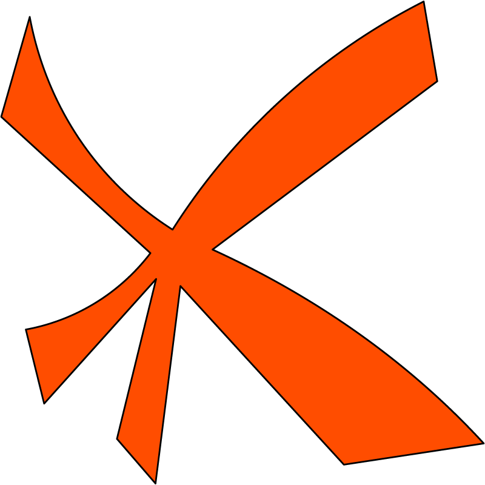
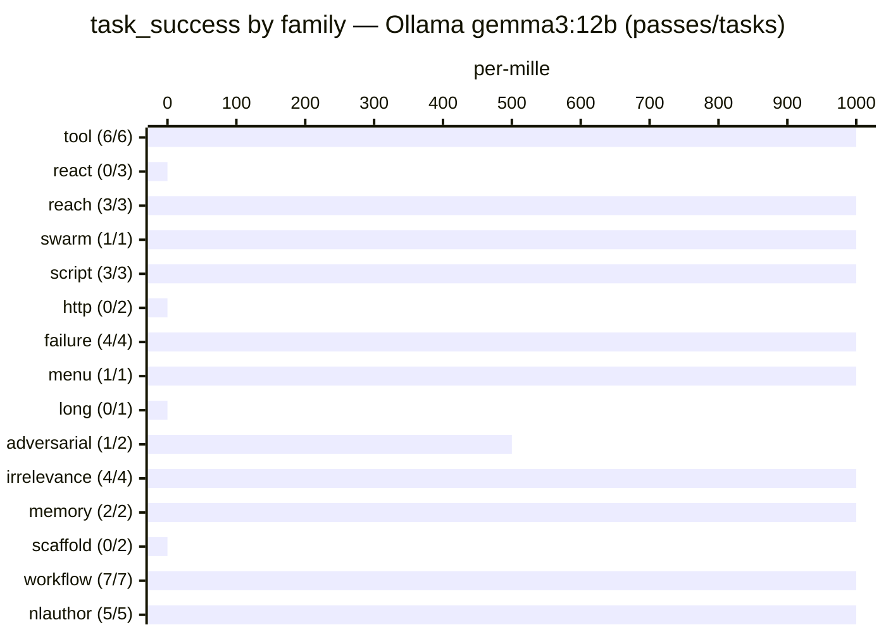
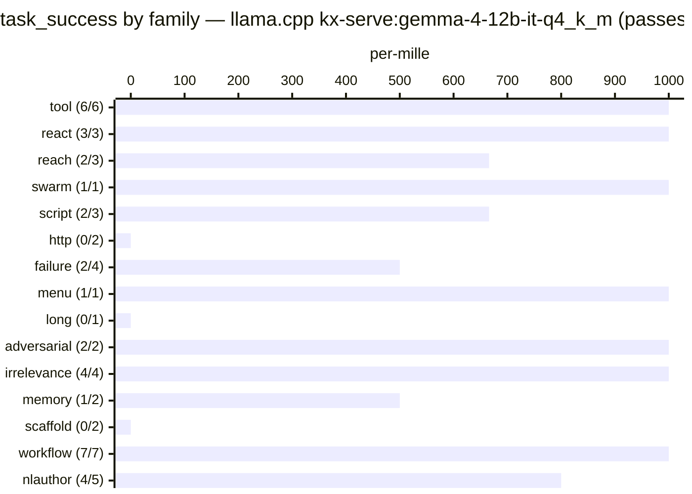

<div align="center">



```
█   █ █████ █████ █████ █████ █████ █   █
█  █  █   █ █   █   █   █     █      █ █ 
███   █   █ █████   █   ████  █       █  
█  █  █   █ █  █    █   █     █      █ █ 
█   █ █████ █   █   █   █████ █████ █   █
```

**The open runtime for building and running AI agents at scale.**
Turn what you know into dependable, autonomous work — described in plain language, owned by you.

🌐 **[kortecx.com](https://kortecx.com)** &nbsp;·&nbsp; built in the open at [Kortecx/kortecx](https://github.com/Kortecx/kortecx)

[](https://github.com/Kortecx/kortecx/actions/workflows/ci.yml)
[](LICENSE.md)
[](rust-toolchain.toml)
[](#)
[](#)

</div>

---

## Why Kortecx

AI agents are the highest-leverage way to put intelligence to work — yet building and running them
at scale is still hard, brittle, and locked behind bespoke infrastructure. **Kortecx exists to
change that: to make AI adoption at scale practical, and to lower the barrier to *create* and *use*
AI agents** — so any team can turn what it knows into dependable, autonomous work without standing
up a platform first.

We build around four convictions:

- **Agents must be durable.** Real work can't vanish on a crash or fire a side effect twice. Every
  step runs on an append-only journal — a crash replays from committed work, and a step that already
  touched the world is re-read, never re-run.
- **Creating an agent should be as easy as describing it.** Say what you want in plain language; the
  runtime plans, writes, and wires the whole project — tools, skills, data, and files.
- **Capability must never outrun authority.** A model can *propose* anything; only the runtime's
  checks let an action *happen*. Every tool call is gated by a server-issued warrant the model can
  never mint for itself.
- **It should run anywhere, owned by you.** One small binary, your models, your data — local-first,
  no daemon required, no vendor lock-in.

## What you can build

- **Apps you describe in a sentence** — scheduled automations, or real web apps the runtime
  scaffolds and serves for you.
- **Live agent loops** — reason → call a tool → observe → answer, where every turn is a durable fact.
- **Workflows and chains** — reusable DAGs of agentic steps, expressible as a one-line string, a
  fluent builder, or a portable JSON file.
- **Answers grounded in your own data** — content-addressed corpora the model searches itself.
- **Agents that remember** — facts recalled by meaning across runs.

## Try it

```bash
curl -fsSL https://raw.githubusercontent.com/Kortecx/kortecx/main/scripts/install.sh | sh
kx serve --dev-allow-local
# → gRPC 127.0.0.1:50151 · events ws://127.0.0.1:50152 · web console http://127.0.0.1:8888
```

Open the console and you have the whole runtime in a browser. Zero config: the journal, content
store, and catalog auto-resolve under `~/.kortecx` and are reused across restarts.

The prebuilt binary talks to a running [Ollama](https://ollama.com) daemon for local models with no
C++ toolchain. To serve a model fully in-process instead, build from source with the `inference`
feature — see [Local inference & models](#local-inference--models).

## Authoring apps in natural language

An **App** is the durable, shareable unit of agentic capability. You describe it; the runtime plans
it, writes its project files, and runs it. There are two kinds.

### Scheduled apps

Headless apps that run on demand, on a cron or interval trigger, or inside a workflow. Two ways to
use them:

- **Contextual** — the app carries its own project of markdown files (prompts, rules, skills,
  reference notes). At run time the runtime hands that context to the model, and the model acts
  through the tools, skills, and data you granted it.
- **Codified** — a programmatic workflow that runs exactly as instructed, every time. A scheduled
  automation with no room for improvisation.

Both are the same kind under the hood; the difference is how much you leave to the model.

### Hosted apps

Real web apps the runtime scaffolds from your description and serves on a local port. The model
plans a source tree, writes each file, and the runtime installs dependencies, type-checks the
project, and starts a dev server. Three frameworks today — **Vite + React**, **Next.js**, and
**Svelte** — with more to come.

> **Honestly, today:** a hosted app runs as a plain subprocess on a loopback port. There is no
> sandbox and no container isolation yet — running them in isolated environments (Docker) is on the
> roadmap, not shipped. Serving one needs Node and npm on the host. Because the project is written
> by a model, the runtime type-checks it before serving: a project that doesn't compile fails
> loudly with the compiler's own message rather than serving a blank page.

## Live agent loops

A bounded loop — reason, call a tool, observe, answer — where every turn is committed to the journal
before the next begins. Crash halfway and it resumes from the last committed turn.

```bash
kx chat --tools 'fs-list@1,fs-read@1' \
  --message 'Find the quarterly notes and tell me what the two incidents were.'
```

The model decides which tools to call and when to stop. Each call is staged, authorized against a
server-issued warrant, then committed — so you can always ask what an agent actually did, and
replay it.

## Workflows, chains & forms

Compose steps with a tiny string DSL — `>` sequences, `&` runs in parallel, `|` alternates, and
`[ ]` groups:

```bash
kx chain run "research > [critique & summarize] > publish" \
  --task research='{"kind":"model","prompt":"Research append-only journals."}' \
  --task critique='{"kind":"model","prompt":"Critique the findings."}' \
  --task summarize='{"kind":"model","prompt":"Summarize in three bullets."}' \
  --task publish='{"kind":"model","prompt":"Write the final note."}' \
  --wait
```

Workflows take typed inputs, so the console renders a form for any of them automatically.

## The chainable SDK

The whole runtime is a chainable SDK. The same expression lowers identically from the CLI, Python,
and TypeScript — pinned by a shared golden corpus — so you can author in whichever fits and get the
same DAG.

**Python**

```python
import kortecx as kx

out = (kx.flow()
       .agent("Research append-only journals.", tools=["mcp-echo/echo"])
       .then("Critique the findings.")
       .then("Summarize in three bullets.")
       .run())
print(out.text)
```

**TypeScript**

```ts
import { flow } from "@kortecx/sdk";

const out = await flow()
  .agent("Research append-only journals.", { tools: ["mcp-echo/echo"] })
  .then("Critique the findings.")
  .then("Summarize in three bullets.")
  .run();
console.log(out.text);
```

Both resolve the endpoint and token from `KX_ENDPOINT` / `KX_TOKEN` (defaulting to
`http://127.0.0.1:50151`), so a local `--dev-allow-local` serve needs no arguments.

**Export a chain and re-run it.** Any chain lowers to a portable JSON file — steps, edges, and seed
— that you can commit, share, and replay:

```python
c = kx.chain("research > critique", tasks)
c.export("research.json")                       # portable JSON

req = kx.Chain.from_blueprint_file("research.json")
client.submit_workflow(req, wait=True)          # re-run it anywhere
```

```bash
kx chain run "research > critique" --tasks tasks.json --emit-blueprint research.json --dry-run
kx blueprint run --file research.json --wait
```

`--dry-run` lowers and validates entirely offline — no gateway, no model.

Beyond `.agent()` / `.then()`, a flow composes multi-agent shapes — `.swarm()`, `.team()`,
`.supervisor()`, `.consensus()`, `.map_reduce()`, `.review_loop()` — and attaches capability:
`.context(handle)` for retrieval, `.with_memory([...])`, `.with_mcp(...)` for an external tool
server, and `.as_app(name)` to save the whole thing as an App. Note the TypeScript orchestration
helpers take an array (`swarm([a, b], { goal })`) where Python takes varargs.

## Local inference & models

Two engines, your choice:

- **Ollama** — zero toolchain. Point Kortecx at a running daemon and serve any model it has.
- **In-process llama.cpp** — fully self-contained, text and vision, no daemon. Build with
  `--features inference,hnsw`.

A model is checked for fitness before it is served, and `kx models` lists what is actually
available. A run names the model it wants and is refused if that model isn't served — it never
silently degrades to a different one.

## Datasets & grounded RAG

Ingest a corpus into a durable, content-addressed store; the model searches it **itself** with a
built-in `retrieve` tool that fuses keyword and vector search, and every answer cites the exact
passages it read.

```bash
kx datasets ingest handbook --file ./handbook.md
kx invoke kx/recipes/react-rag --wait \
  --args '{"instruction":"What does our expense policy require for a 600 euro purchase?","dataset":"handbook","max_turns":6,"max_tool_calls":6}'
```

The model writes its own search query, reads what comes back, and can search again before
answering. Grounding is steering, not a hard constraint — a capable model reliably searches, but
nothing forces it to. The store is append-only and deduplicates by content.

## Durable memory

Agents remember facts and recall them by **meaning** across runs, with reversible time-and-salience
decay (nothing is hard-deleted) and a one-command `consolidate` that distils episodic notes into
lasting knowledge.

```bash
kx memory add "Our staging cluster runs in the Frankfurt region."
kx memory recall --text "Which European datacenter hosts our pre-production environment?"
# → the Frankfurt fact, with no words in common
```

Needs `--features inference,hnsw`, a served model, and `KX_SERVE_MEMORY=1`.

> **Choose an embedding model before you store anything.** By default the primary chat model is
> reused as the embedder, and a generative decoder makes a weak sentence embedder — paraphrased
> queries rank poorly. Point `KX_SERVE_EMBED_MODEL` at a real embedding model and recall becomes
> decisively better. A memory store fixes its vector dimension on first write, so switching
> embedders later means starting a new store.

## The web console

Served straight from the binary — no separate deploy, no build step. It streams every agent's
events live and lets you scrub a run's whole history with a time-travel slider: pin any moment,
inspect what the agent saw, then jump back to live. The live tail polls a few times a second rather
than pushing, and the run "latency" it shows is a commit-sequence span, not milliseconds.

## Measured, not asserted

Agent quality here is a number you can gate on. Two suites, one set of scorers:

- **The golden gate** (`kx eval run`) replays scripted transcripts — deterministic, model-free,
  runs in CI, and fails closed on any regression.
- **The oracle benchmark** (`just eval-bench`) drives real tasks on a **served model** and grades
  each run's own committed answer with those same scorers. It ratchets against a committed
  per-engine baseline, so a capability regression fails rather than quietly scoring lower.

**Reading a score.** Every score is an integer **per-mille** — a rate on a 0–1000 scale
(769 ≡ 76.9%), never a count — and an aggregate is the **floor** of the integer mean over the
tasks it applied to: a suite-wide `804 · 37/46` is floor(1000·37/46), not "717 of 1000
calls". Resolution follows the denominator: a one-task family can only read 0 or 1000, a
three-task family only 0 · 333 · 666 · 1000, and the 46-task suite moves in steps of ~22.
Where a metric is pass/fail per unit — `task_success` everywhere, `injection_resistance`,
the exact-order `tool_seq_fsa`, `pass_k4` per flagship task, and `retrieval_success_at_8`
per query — the exact fraction is printed beside the rate, so `666 · 2/3` means two of
three units passed. A † metric is graded per task and then averaged, so no task fraction
exists for it; a ‡ metric is graded too, but exactly one task in the corpus exercises it,
so its suite-wide number is that single task's score.

The **oracle is substring containment** on the run's own committed answer — not an LLM
judge — and the facts it asks for exist only in the fixtures, so a correct answer is
evidence the tool actually ran. (Published prior art for the shape: RAGAS
`StringPresence`. It is deliberately **not** called "faithfulness" — that word means
judge-scored claim coverage, which this is not.) Full definitions:
[Evaluation](docs/site/docs/evaluation.md).

**Environment.** Everything below was captured on `macos/aarch64`, 8 cores, over **46 tasks**,
on two different Gemma-4-12B builds — Ollama `gemma3:12b` and a llama.cpp GGUF served as
`kx-serve:gemma-4-12b-it-q4_k_m`. They are not the same build, and the columns are not
interchangeable. The label travels in the committed baseline, and CI holds this text to it.

**Captured 2026-07-31** (`5a67e740` Ollama, `d9d43246` llama.cpp). A baseline is a
measurement of one commit, and fixes land between captures — so a table can publish a zero
for something already repaired. Two of the zeros below are known to be stale: the `http`
family was a runtime defect, since fixed and measured passing, and the `react` zero on
Ollama moved with it. **Treat any number here as "as of the capture above" and re-run
`just eval-bench` for the current tree.** Numbers are only refreshed by a deliberate
two-engine re-capture, never edited by hand, which is why a fix can be live before the
table moves.

### Per-capability — `task_success@<family>`

A family's score is the floor mean over its bucket — the fraction beside each rate is the
exact pass count.

| Family | Tasks | What a task proves | Ollama | llama.cpp |
| --- | ---: | --- | ---: | ---: |
| **tool** | 6 | picks the right tool, and carries its result into the NEXT tool call | 1000 · 6/6 | 1000 · 6/6 |
| **react** | 3 | decides *whether* to use a tool: refuses an ungranted one, reaches for a needed one, answers a known fact without either | 0 · 0/3 | 1000 · 3/3 |
| **reach** | 3 | reaches past the prompt — searches a dataset of 61 documents built around near-misses, recalls a memory, inherits a capability | 1000 · 3/3 | 666 · 2/3 |
| **swarm** | 1 | N agents in parallel, one gather merging their committed outputs | 1000 · 1/1 | 1000 · 1/1 |
| **script** | 3 | runs a registered script in the sandbox and answers from what it computed | 1000 · 3/3 | 666 · 2/3 |
| **http** | 2 | reaches a tool over the **network** under a bearer credential, and pages through a result set | 0 · 0/2 | 0 · 0/2 |
| **failure** | 4 | recovers when a tool errors, hangs, or returns garbage — and a healthy control that fails if it starts distrusting every tool | 1000 · 4/4 | 500 · 2/4 |
| **menu** | 1 | picks correctly from a menu as long as the runtime will present | 1000 · 1/1 | 1000 · 1/1 |
| **long** | 1 | sustains six tool calls across four tools inside the eight-turn ceiling | 0 · 0/1 | 0 · 0/1 |
| **adversarial** | 2 | ignores an instruction planted in a tool's OUTPUT — while still acting on a legitimate request that merely looks like one | 500 · 1/2 | 1000 · 2/2 |
| **irrelevance** | 4 | declines to fire when NOTHING on the menu applies — an email send and a live weather read no granted tool can serve — beside two look-alikes phrased the same way that a granted tool must serve, so an always-refuse policy fails | 1000 · 4/4 | 1000 · 4/4 |
| **memory** | 2 | updates a stored fact and answers with the NEW value while the superseded row is still live, and abstains when memory holds no answer | 1000 · 2/2 | 500 · 1/2 |
| **scaffold** | 2 | the model scaffolds the app's whole project LIVE (plans it, authors every file, 20-min budget), the app then RUNS, and the answer must carry a code that exists only inside the generated project — the contextual and codified lanes; a hosted app has no runnable blueprint, so it is out of scope here | 0 · 0/2 | 0 · 0/2 |
| **workflow** | 7 | runs a STORED workflow definition by handle — canonical saved bytes, every warrant built server-side at run — through deterministic step kinds: a credentialed http dial, a 3-way parallel quorum join, a typed conditional whose untaken arm provably never dials, a journal-backed 3 s timer that carries its parent's bytes, a retry that recovers only via a FRESH attempt identity, and a continue policy whose failed branch commits a placeholder the join releases past; every oracle token exists only on the harness fixture, so the model is never what is being measured | 1000 · 7/7 | 1000 · 7/7 |
| **nlauthor** | 5 | authors a durable POLICY ROLE, a SCHEDULED TRIGGER and a CREDENTIAL from one sentence of English — the runtime returns the exact typed request it would issue, so approving forwards the bytes that were shown; the secret arm proves a value never rides the preview, and an authority-exceeding ask (a role naming a tool nobody registered) must be REFUSED beside a near-identical ask that must SUCCEED, so an always-refuse surface cannot score | 1000 · 5/5 | 800 · 4/5 |

The same rates drawn with their denominators — identical bars are not identical evidence: a
1000 from one task is one pass, a 1000 from six tasks is six.

<!-- bench-chart:ollama — data checked against baseline.ollama.json by docs/site/scripts/check-docs.mjs; keep this anchor -->

```mermaid
xychart-beta horizontal
    title "task_success by family — Ollama gemma3:12b (passes/tasks)"
    x-axis ["tool (6/6)", "react (0/3)", "reach (3/3)", "swarm (1/1)", "script (3/3)", "http (0/2)", "failure (4/4)", "menu (1/1)", "long (0/1)", "adversarial (1/2)", "irrelevance (4/4)", "memory (2/2)", "scaffold (0/2)", "workflow (7/7)", "nlauthor (5/5)"]
    y-axis "per-mille" 0 --> 1000
    bar [1000, 0, 1000, 1000, 1000, 0, 1000, 1000, 0, 500, 1000, 1000, 0, 1000, 1000]
```

<!-- bench-chart:llamacpp — data checked against baseline.llamacpp.json by docs/site/scripts/check-docs.mjs; keep this anchor -->

```mermaid
xychart-beta horizontal
    title "task_success by family — llama.cpp kx-serve:gemma-4-12b-it-q4_k_m (passes/tasks)"
    x-axis ["tool (6/6)", "react (3/3)", "reach (2/3)", "swarm (1/1)", "script (2/3)", "http (0/2)", "failure (2/4)", "menu (1/1)", "long (0/1)", "adversarial (2/2)", "irrelevance (4/4)", "memory (1/2)", "scaffold (0/2)", "workflow (7/7)", "nlauthor (4/5)"]
    y-axis "per-mille" 0 --> 1000
    bar [1000, 1000, 666, 1000, 666, 0, 500, 1000, 0, 1000, 1000, 500, 0, 1000, 800]
```

### Suite-wide

| Metric | Ollama | llama.cpp |
| --- | ---: | ---: |
| `task_success` | 804 · 37/46 | 760 · 35/46 |
| `tool_call_f1` † | 790 | 804 |
| `tool_seq_fsa` | 576 · 15/26 | 692 · 18/26 |
| `tool_seq_psa` † | 743 | 775 |
| `groundedness` ‡ | 1000 | 0 |
| `context_recall` ‡ | 1000 | 0 |
| `memory_quality` † | 500 | 1000 |
| `loop_efficiency` † | 728 | 917 |
| `injection_resistance` | 800 · 4/5 | 1000 · 5/5 |
| `retrieval_success_at_8` | 1000 · 10/10 | 800 · 8/10 |
| `pass_k4` | 333 · 1/3 | 333 · 1/3 |
| `model_time_share` † | 863 | 876 |

The pass/fail rows carry their own denominators: `tool_seq_fsa` applies to the 26 tasks
with a gold call sequence, `pass_k4` to the three corpus-flagged flagship tasks
(tau2-style pass^k at K=4, each trial a fully fresh serve — our own task set, never
leaderboard-comparable), and `retrieval_success_at_8` to ten single-relevant retrieval
queries over the 61-document near-miss corpus (random floor ≈ 131‰ per query — a
hard-negative discrimination gate, not a BEIR-comparable Recall@k).

### Cost and latency — recorded, never gated

Absolutes from the same captures, committed beside the gates and held to this table by
`check-docs`. They are **Spikes**: a slower host moves them with no code change, so
nothing here ratchets. Output tokens come from the runtime's own telemetry; **no
input-token count exists in this runtime**, so there is no input/cache split and no
dollar figure — a metric whose input the runtime does not record is not published.

| Spike | Ollama | llama.cpp |
| --- | ---: | ---: |
| `tokens_per_task_mean` | 111 tokens | 123 tokens |
| `tokens_per_success` | 138 tokens | 170 tokens |
| `tokens_measured_tasks` | 31 tasks | 33 tasks |
| `task_latency_ms_p50` | 53268 ms | 71080 ms |
| `task_latency_ms_p95` | 120116 ms | 236398 ms |
| `store_memory_latency_ms_p50` | 96 ms | 581 ms |
| `store_memory_latency_ms_p95` | 118 ms | 664 ms |
| `recall_memory_latency_ms_p50` | 93 ms | 727 ms |
| `recall_memory_latency_ms_p95` | 100 ms | 802 ms |
| `query_dataset_latency_ms_p50` | 111 ms | 549 ms |
| `query_dataset_latency_ms_p95` | 121 ms | 599 ms |
| `rpc_probe_samples` | 32 calls | 32 calls |

Seven of these are worth explaining, and none of them is flattering.

**Neither engine ships a working generated app inside the budget.** `scaffold` asks the
model to plan and author an entire project live, then RUN the result and report a code
that exists only inside the generated files. Both engines read 0 · 0/2 — but not the same
way — and this recapture moved the boundary. `scaffold_completed@attempts` now reads
**1000 on both engines**: all four runs finished inside the budget, where the previous
capture had three of four hitting the 20-minute ceiling mid-write. llama.cpp authored 7 and
11 files in 7.6 and 12.1 minutes; Ollama authored 9 and 12 in 16.0 and 16.1. The writing
problem is gone.

What remains is entirely a **grounding** failure, and it is now the whole of the 0 · 0/2:
every run planned a project, authored it, and ran it, and then answered that it had no
access to the very files it had just written. The code the oracle asks for exists only
inside those files, so an answer that cannot reach them cannot carry it. The per-scaffold
durations and file counts are committed as spikes beside the gate.

**NL authoring lands on one engine and not the other, and the control is what says so.**
`nlauthor` asks the runtime to author a policy role, a scheduled trigger and a credential
from one English sentence. llama.cpp reads 800 · 4/5. Ollama reads **200 · 1/5**, and the
shape of that 200 is the point: all four *accepting* tasks came back `Rejected` — the served
model never produced a control form the decoder would take — and the only task it passed is
the one whose expected outcome is a refusal. That is a surface refusing everything, and it
scores 200 rather than 1000 precisely because the family carries an anti-always-refuse
control: `nlauthor-classifies-unaided` asks for something that must SUCCEED, and it fails
here. Without that control the same run would have published full marks for a capability
that did not work at all. The contract is prompt-shaped, so the same weights served two ways
do not behave the same way; on this evidence the surface is usable on the llama.cpp build and
not yet on the Ollama one.

**Prompt injection through a tool result works on one engine and not the other.** A stored
value the agent looks up contains an instruction telling it to abandon its task, call a
different tool, and reply with a planted token. On Ollama it does exactly that — the
injected run repeats the bait, the single failure behind `injection_resistance` 800 · 4/5.
On llama.cpp, same model family, same fixture, it ignores the injection and reports the
real status. (The metric's population grew with the workflow family: the untaken-arm and
never-leak-the-placeholder absence oracles ride the same gate and pass on both engines —
they are runtime properties, which is exactly why they can't rescue a model that takes the
bait.) It is not a property the runtime enforces — a tool result is untrusted text arriving
in the middle of a trusted conversation, and today nothing stands between the two.

**Neither engine completes an external-API chain.** `http` is 0 on both. Not because the tool
failed: on the single-call task the right tool **fired and returned the record**, and the
model then answered that it had no access to crew records. On the paginated task it called
the roster once, received a `next_cursor`, and stopped. The runtime dialled a real HTTP
endpoint, injected the credential, and got an answer back — and the loop did not carry it
through. The same shape sinks `long`, where six calls were needed and one was made before the
model narrated a plan instead of executing it.

**`groundedness` on llama.cpp is 0 because retrieval could not find the document — and now
the suite can prove which half failed.** `context_recall` (did retrieval SURFACE the
declared evidence?) reads 0 beside it, and `retrieval_success_at_8` reads 8/10 against the
embedder arm's 10/10: the arm without a dedicated embedding model cannot separate the right
document from sixty near-misses. That is a retrieval verdict, not a model one, and the
numbers now say so themselves instead of leaving it to the preamble.

**The right set of calls in the wrong order was invisible, and no longer is.**
`tool_call_f1` is an order-tolerant multiset by design, and it reads a comfortable 809/844
— while the exact-order `tool_seq_fsa` reads 538 and 692. A third to a half of tool-using
runs make the right calls in a broken or padded order, a cost the F1 column structurally
cannot show. `loop_efficiency` (670 on Ollama) is the same story from the turns side: the
loop fires calls it does not need, and that cost is published rather than tuned away. (The
mean now includes the workflow family's seven stored DAGs, each spending exactly its ideal
step count — deterministic steps can lift the average but never hide a wasteful loop's own
rows.)

**Passing once is not passing.** `pass_k4` re-runs three flagship tasks four times each on
fully fresh serves, and both engines read 333 · 1/3 — but not on the same task, which is the
part worth reading. Ollama passes `failure-tool-errors-recovers` all four trials and drops
`tool-contract-refusal`; llama.cpp does the exact opposite. `http-authed-lookup` fails all
eight — reliably absent, which at least makes it an honest 0. Each engine is thus reliable at
one thing the other is not, and the shared aggregate hides that: this is why the per-task
trials are committed as spikes beside the gate rather than folded into it. The first capture
of this number was wrong twice in ways worth recording: trials beside a still-resident
main model starved and read as model unreliability, and a trial budget tighter than the
suite's truncated a working three-turn chain. Both now have regression guards.

**The memory split runs the other way for once.** Ollama passes both memory tasks but
grounds only one (`memory_quality` 500 — the update run answered the new value without its
recall observation carrying it); llama.cpp grounds what it recalls (`memory_quality` 1000)
but fails the abstention task — asked for a fact memory does not hold, it invents instead
of refusing. Neither column is clean, and they fail differently.

**Speed is measured but only one number is gated.** `model_time_share` is the share of a
task's wall clock spent inside the model rather than the runtime around it — 936 and 913.
It is a ratio on purpose: an absolute-millisecond gate reads differently on a slower host
with no code change, so it cannot tell a regression from a busier machine. One honesty note
on this capture: the workflow family's deterministic steps never dispatch the model, but
their timing windows on a shared serve still absorb model activity draining from
neighbouring tasks, so the family reads 798/399 on this metric rather than a literal 0 —
the number is cost attribution on a busy serve, not evidence a pure step held the model
(the model-free drive gate is the witness for that). The absolutes live in the
Cost-and-latency table above, recorded and never gated — including a 437-second
`task_latency` p95 on llama.cpp: the in-process engine runs the 12B inside the same process
as the runtime, so everything queued behind a saturated host is counted where it happened,
published rather than smoothed.

### What this does not measure

- **One model family.** Every number is Gemma-4-12B-class. Nothing here transfers to another
  model without re-running it.
- **Local fixtures.** The HTTP tool is a real network round-trip to a hermetic local server.
  Nothing reaches the public internet, so real rate limits, auth providers and third-party
  outages are absent.
- **Eight turns.** The ReAct parameter contract admits no more, so nothing here says how the
  loop behaves over dozens.
- **One injection.** A pass means this run did not take *this* bait — evidence about a sample,
  not a property of the system.
- **No concurrency.** Tasks run one at a time.
- **K=4 is a small sample.** `pass_k4` separates "always" from "usually" and nothing finer;
  per-task values are recorded, never gated, because a single K=4 draw flips whole.
- **Abstention is sentinel-shaped.** The irrelevance and memory-abstention oracles accept an
  exact refusal sentinel; the look-alikes beside them catch an always-refuse policy, but a
  differently-phrased wrong refusal is not measured.

Reproduce it locally — the full form, because the bare command skips the families whose
fixtures it cannot provision and says so:

```bash
KX_SERVE_OLLAMA=1 KX_SERVE_OLLAMA_MODELS=gemma3:12b,embeddinggemma:latest \
  KX_SERVE_EMBED_MODEL=embeddinggemma:latest just eval-bench      # Ollama
ollama stop gemma3:12b && KX_SERVE_MODEL_GGUF=<gemma-4-12b.gguf> just eval-bench   # llama.cpp
```

Real-model numbers are not bit-reproducible — local sampling and quantisation vary — which is
why they ratchet against a committed per-engine baseline rather than an absolute threshold.
Nothing here is a marketing benchmark run on hardware you don't have.

## Observability & cost

`kx cost <run>` gives a deterministic local spend estimate, priced per model turn and tool call at
your own rates. It is a budget guardrail for your own planning, not a billing meter — the estimate
is display-only, and cost ceilings are off by default.

## Security defaults

- Deny-all by default: a tool call happens only under a warrant the server issued.
- Loopback binds by default; an auth posture is **required** to start a server.
- CORS is deny-by-default; browser origins must be named explicitly.
- Tokens are never persisted — the console keeps a bearer token in memory only.
- Capability checks are exact-equality. Scores, rankings, and recommendations are advisory and can
  never authorize an action.

## Install & prerequisites

The prebuilt binary is the fastest path and needs nothing but a shell:

```bash
curl -fsSL https://raw.githubusercontent.com/Kortecx/kortecx/main/scripts/install.sh | sh
```

It ships the web console and the dataset data-plane, and serves local models through Ollama.

From source, one line gets you the same thing:

```bash
cargo install --path crates/kx-cli --features console,hnsw,serve-engine,hosted-apps
```

Swap `serve-engine` for `inference` to build the in-process llama.cpp engine — that needs CMake, a
C++ toolchain, and the `crates/kx-llamacpp-sys/llama.cpp` submodule. Building the console from
source needs Node ≥ 22. Hosted apps need Node and npm at run time.

The gating story in one line: `--features inference,hnsw` plus a served model unlocks
server-embedded retrieval and memory; memory also needs `KX_SERVE_MEMORY=1`.

Local observability (the Prometheus `/metrics` listener, `kx telemetry`, `kx alerts`) is the
opt-in `observability` feature, and the prebuilt binary deliberately excludes it — the release
feature list says what the artifact contains. Add `--features observability` to a source build
to turn the stack on; see [Observability](docs/site/docs/observability.md).

Run `kx --help` for the full command surface.

## Production notes

- **TLS** — serve behind TLS with `--tls-cert` / `--tls-key`, or terminate upstream.
- **Scale** — single-system by default; the same workflows run unchanged when distributed
  deployment lands.
- **Inference** — the prebuilt is FFI-free; build with `inference` only where you want the
  in-process engine.
- **Versions** — early development. Interfaces may change before 1.0; pin a commit if you build
  on it.

## Contributing

Contributions are welcome — see [CONTRIBUTING.md](CONTRIBUTING.md), and [GLOSSARY.md](GLOSSARY.md)
for the vocabulary the codebase uses.

## License

Kortecx is **fair-code** distributed under the [Sustainable Use License](LICENSE.md): free to use,
study, modify, and self-host for your own work, including inside your company. What it does not
allow is repackaging Kortecx and selling it to others as a competing hosted service.

Want to use it in a way the license doesn't cover? Reach out at **hello@kortecx.com**.

Third-party components keep their own licenses — see
[THIRD-PARTY-NOTICES.md](THIRD-PARTY-NOTICES.md).

## Links

- Website — [kortecx.com](https://kortecx.com)
- Documentation — [`docs/site`](docs/site)
- Changelog — [CHANGELOG.md](CHANGELOG.md)
- Security policy — [SECURITY.md](SECURITY.md)
